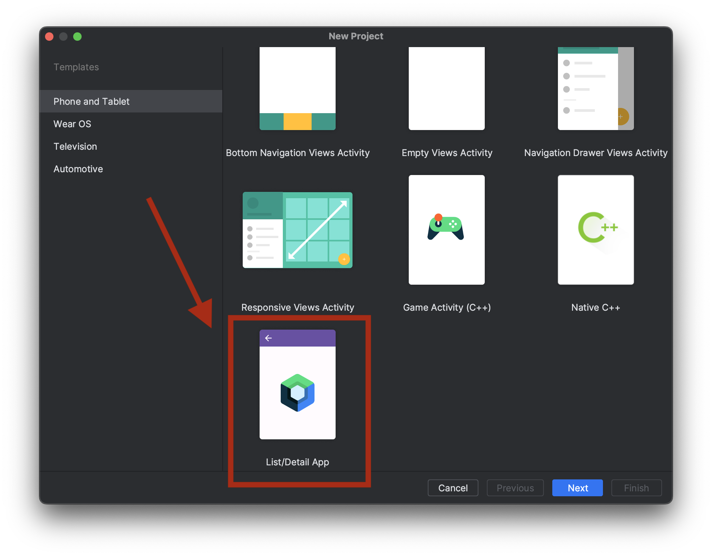
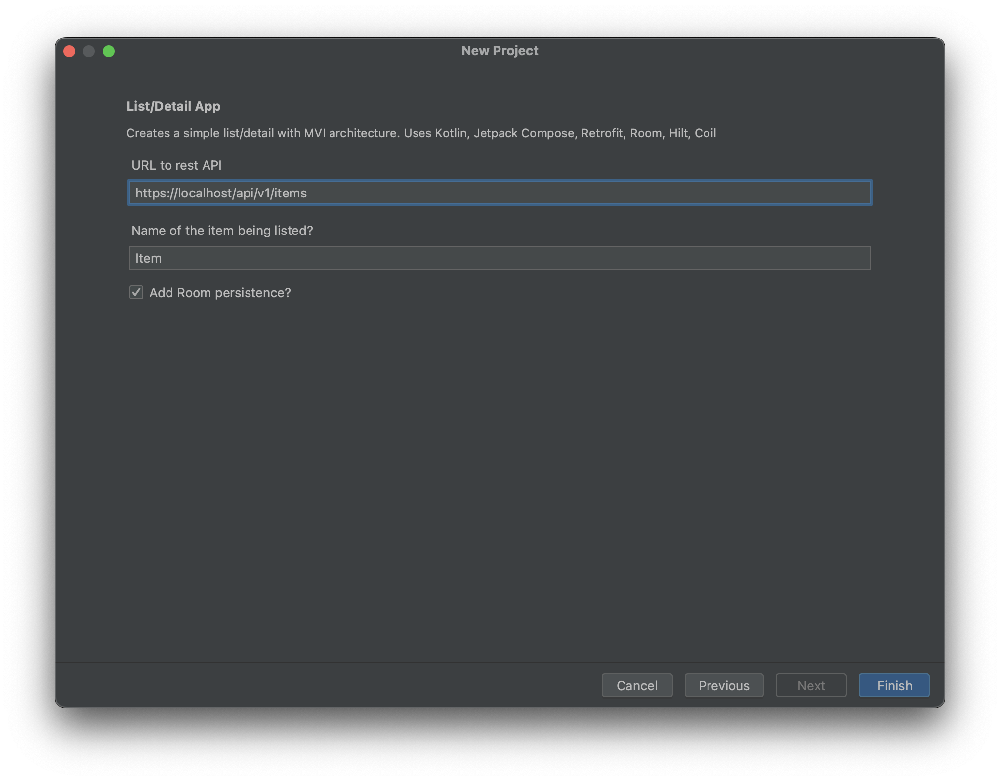

# Android Studio Project Templates

## What is this?

This implements an Android Studio project template to create new project in Android Studio.

The template is based on my List/Detail app based on my [Rick & Morty](https://github.com/jamesonwilliams/rick-morty-compose/tree/main) demo app.

The template accepts an item name, which will be used widely around the project for file naming and model naming. For example, your list detail app might list animals, and show details on a particular Animal.

The project also accepts a URL which will be plugged into Retrofit.

## Cool, how can I install it?

You can install it from the [JetBrains IDE Marketplace](https://plugins.jetbrains.com/plugin/23316-list-detail-app-project-template?noRedirect=true) directly from the Android Studio Welcome Wizard:

https://github.com/jamesonwilliams/android-studio-templates/assets/899569/9d860e89-116a-4998-b436-91af6cbdac35

## Where did it come from?

This is a fork of [Sasikanth](https://github.com/msasikanth/my-project-templates)'s project.

More details on how to build/deploy the plugin are in [Sasikanth's blog](https://www.sasikanth.dev/creating-project-templates-in-android-studio/).

Thank you to Sasikanth for his earlier work.

## Why Doesn't this showcase Approaches X,Y, instead?

Got feedback on the template? [Create an issue](https://github.com/jamesonwilliams/android-studio-templates/issues/new)!

## Versioning Status

Version 0.2 supports these Android Studio versions:

| Friendly Name | Release Name | Internal Build Number |
|---------------|--------------|-----------------------|
| Android Studio Koala | 2024.1.1 Canary 3 | 241.14494.158.2411.11648550 |
| Android Studio Jellyfish | 2023.3.1 RC 1 | 233.14808.21.2331.11643467 |
| Android Studio Iguana | 2023.2.1 Patch 1 | 232.10300.40.2321.11567975 |
| Android Studio Iguana | 2023.2.1 Release | 232.10227.8.2321.11479570 |
| Android Studio Iguana | 2023.2.1 Canary 8 | 232.9921.47.2321.10958940 |
| Android Studio Hedgehog | 2023.1.1 Patch 2 | 231.9392.1.2311.11330709 |
| Android Studio Hedgehog | 2023.1.1 Patch 1 | 231.9392.1.2311.11255304 |
| Android Studio Hedgehog | 2023.1.1 Release | 231.9392.1.2311.11076708 |

Version 0.1 supported Android Studio Hedgehog (2023.1.1).

